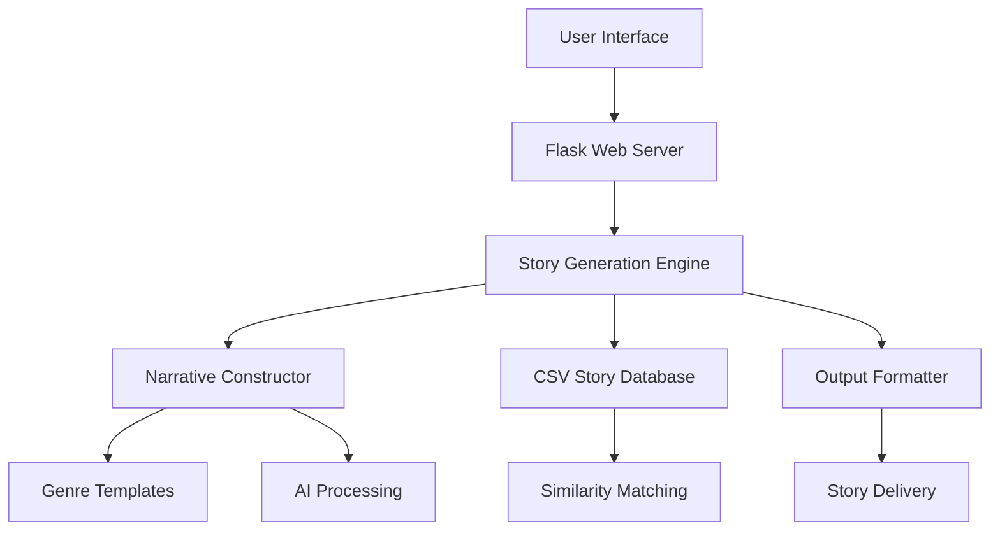

# 🧠 BrainROT Comics - AI Story Generator

<div align="center">


**Transform simple prompts into captivating, professionally-structured stories with advanced AI technology**

[](https://python.org)
[](CONTRIBUTING.md)

*Where Imagination Meets Artificial Intelligence*

</div>

## ✨ Features

### 🎭 Multi-Genre Story Generation
- **Fantasy** 🏰 - Epic quests, magical realms, and ancient prophecies
- **Sci-Fi** 🚀 - Futuristic technology, space exploration, and AI dilemmas  
- **Mystery** 🔍 - Intriguing puzzles, detective work, and hidden conspiracies
- **Romance** 💖 - Heartfelt connections, emotional journeys, and destiny
- **Adventure** 🗺️ - Exciting expeditions, treasure hunts, and exploration
- **Horror** 👻 - Suspenseful tales, supernatural encounters, and psychological thrill
- **Comedy** 😄 - Humorous situations, witty characters, and laugh-out-loud moments

### 🎯 Advanced AI Capabilities
- **Intelligent Prompt Understanding** - Deep comprehension of user inputs
- **Structured Narrative Generation** - Professional story arcs with proper pacing
- **Character Development** - Dynamic characters with motivations and growth
- **Genre-Specific Templates** - Tailored content for each story type
- **Length Customization** - Short, medium, or long stories to fit your needs

### 🎨 User Experience
- **Beautiful Web Interface** - Modern, responsive design
- **Real-time Generation** - Instant story creation
- **Example Prompts** - Quick inspiration starters
- **Copy & Export** - Easy sharing capabilities
- **Session Management** - Continuous storytelling experience

## 🚀 Quick Start

### Prerequisites
- Python 3.8 or higher
- pip (Python package manager)

### Installation

1. **Clone the repository**
```bash
https://github.com/GanapathiRajanG/BrainRot-Comics.git
cd brainrot-comics
```

2. **Create virtual environment** (Recommended)
```bash
python -m venv .venv
source .venv/bin/activate  # On Windows: .venv\Scripts\activate
```

3. **Install dependencies**
```bash
pip install -r requirements.txt
```

4. **Initialize the story database**
```bash
python data/create_enhanced_csv.py
```

5. **Launch the application**
```bash
python app.py
```

6. **Open your browser and visit**
```
http://localhost:5000
```

## 🏗️ System Architecture

### Core Components



### Technology Stack

| Layer | Technology | Purpose |
|-------|------------|---------|
| **Frontend** | HTML5, CSS3, JavaScript | User interface and interactions |
| **Backend** | Flask, Python | Web server and API management |
| **AI Engine** | Pandas, Custom Algorithms | Story generation and processing |
| **Data** | CSV Database | Story templates and examples |
| **Styling** | Custom CSS, Gradients | Modern visual design |

## 📚 Usage Examples

### Sample Prompts and Outputs

| Prompt | Genre | Sample Output |
|--------|-------|---------------|
| `A robot exploring an abandoned spaceship` | Sci-Fi | **Title**: The Exploration Protocol<br>**Story**: When Unit-734 activated in the derelict starship, it discovered logs of the crew's final moments and a mysterious signal from deep space... |
| `A mage discovering a time crystal` | Fantasy | **Title**: The Crystal of Eternal Starlight<br>**Story**: In the ancient kingdom of Eldoria, Elara discovered the Crystal of Eternal Starlight that showed visions of past and future... |
| `A detective solving ghost mysteries` | Mystery | **Title**: The Spectral Investigation<br>**Story**: Detective Morgan never believed in ghosts until cases started solving themselves with supernatural help... |

### API Endpoints

```http
POST /generate_story
Content-Type: application/json

{
  "prompt": "Your story idea here",
  "genre": "fantasy",
  "length": "medium"
}
```

Response:
```json
{
  "title": "Generated Story Title",
  "content": "Full story content...",
  "prompt": "Your original prompt",
  "genre": "fantasy",
  "length": "medium",
  "source": "narrative_generator"
}
```

## 🎨 Customization

### Adding New Genres
1. Edit `model/narrative_story_generator.py`
2. Add genre to the templates dictionary
3. Create appropriate story structures

### Modifying Story Templates
```python
# In narrative_story_generator.py
templates = {
    'your-genre': [
        "Your custom story template with {variables}",
        "Another template option"
    ]
}
```

### Styling Customization
- Modify `static/css/style.css` for visual changes
- Update color scheme in CSS variables
- Customize animations and transitions

## 🔧 Advanced Configuration

### Environment Variables
Create a `.env` file for configuration:
```env
FLASK_ENV=development
DATABASE_PATH=./data/stories_dataset.csv
MAX_STORY_LENGTH=5000
ENABLE_ANALYTICS=true
```

### Performance Optimization
- Enable gzip compression for faster loading
- Implement caching for frequently used stories
- Use CDN for static assets in production

## 📊 Project Structure

```
brainrot-comics/
├── app.py                 # Main Flask application
├── requirements.txt       # Python dependencies
├── data/
│   ├── stories_dataset.csv      # Story database
│   └── create_enhanced_csv.py   # Database initializer
├── model/
│   ├── narrative_story_generator.py  # Advanced story generator
│   ├── pandas_story_generator.py     # Pandas-based generator
│   └── simple_story_generator.py     # Fallback generator
├── templates/
│   └── index.html         # Main web interface
├── static/
│   ├── css/
│   │   └── style.css      # Styling and animations
│   └── js/
│       └── script.js      # Frontend functionality
└── README.md              # This file
```

## 🧩 API Documentation

### Story Generation Endpoint
**POST** `/generate_story`

Generates a story based on the provided parameters.

**Parameters:**
```json
{
  "prompt": "string (required)",
  "genre": "string (optional, default: 'fantasy')",
  "length": "string (optional, default: 'medium')"
}
```

**Available Genres:** `fantasy`, `sci-fi`, `mystery`, `romance`, `adventure`, `horror`, `comedy`

**Available Lengths:** `short`, `medium`, `long`

### Health Check
**GET** `/health`

Returns system status and database information.

## 🚀 Deployment

### Local Development
```bash
python app.py
```

### Production with Gunicorn
```bash
pip install gunicorn
gunicorn -w 4 -b 0.0.0.0:5000 app:app
```

### Docker Deployment
```dockerfile
FROM python:3.9-slim
WORKDIR /app
COPY requirements.txt .
RUN pip install -r requirements.txt
COPY . .
CMD ["gunicorn", "-w", "4", "-b", "0.0.0.0:5000", "app:app"]
```

## 🤝 Contributing

We love contributions! Here's how you can help:

1. **Fork the repository**
2. **Create a feature branch** (`git checkout -b feature/amazing-feature`)
3. **Commit your changes** (`git commit -m 'Add amazing feature'`)
4. **Push to the branch** (`git push origin feature/amazing-feature`)
5. **Open a Pull Request**

### Areas for Contribution
- 🎨 New genre templates
- 🔧 Performance optimizations  
- 📚 Additional story examples
- 🐛 Bug fixes and improvements
- 🌐 Translation and localization


## 🙏 Acknowledgments

- **AI Technology** - Advanced natural language processing algorithms
- **Storytelling Community** - Inspiration from writers and creators worldwide
- **Open Source Libraries** - Flask, Pandas, and the Python ecosystem
- **Contributors** - Everyone who helped make this project better

